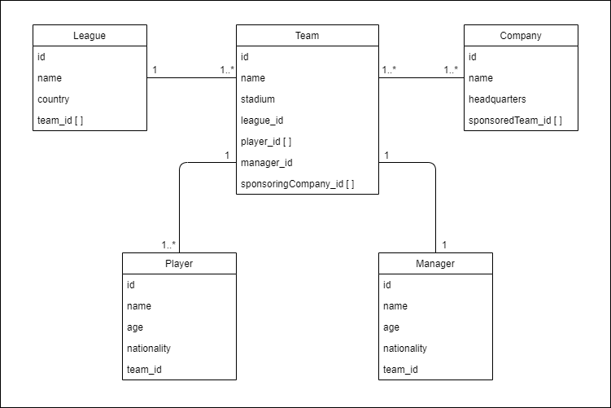

# Football League API ⚽🏆      


        


Football League API is an API that provide the information about the Football League, Team, Sponsoring Company, Players and Manager. This project is dedicated for my learning journey of API Development, especially using Node.js, Express, Prisma and SQLite.       


To test this API locally, you need to have [Node.js](https://nodejs.org/en/) installed on your local machine. Then, kindly download the zip file of the source code. After extract the folder, open the terminal and type       

```Shell
	npm install
	// This will install all the dependencies of the project
```       


I have use Nodemon along this API development. To run this API using Nodemon, simply type     

```Shell
  	npm run dev
```          

then, it will listening port on `3405`       

or, you can use built-in Node.js server. Just type       

```Shell
  	npm run serve
```          

then, it will listening port on `3405`       


## Available API Routes          

`GET` : `http://localhost:3405/api/league`    
`GET` : `http://localhost:3405/api/league/:id`     
`POST` : `http://localhost:3405/api/league`      
`PATCH` : `http://localhost:3405/api/league/:id/name`    
`DELETE` : `http://localhost:3405/api/league/:id`           

`GET` : `http://localhost:3405/api/team`      
`GET` : `http://localhost:3405/api/team/:id`         
`POST` : `http://localhost:3405/api/team`         
`PATCH` : `http://localhost:3405/api/team/:id/name`         
`PATCH` : `http://localhost:3405/api/team/:id/stadium`        
`DELETE` : `http://localhost:3405/api/team/:id`           

`GET` : `http://localhost:3405/api/company`        
`GET` : `http://localhost:3405/api/company/:id`      
`POST` : `http://localhost:3405/api/company`       
`PATCH` : `http://localhost:3405/api/company/:id/sponsored-team`       
`DELETE` : `http://localhost:3405/api/company/:id`      

`GET` : `http://localhost:3405/api/player`       
`GET` : `http://localhost:3405/api/player/:id`       
`POST` : `http://localhost:3405/api/player`        
`PATCH` : `http://localhost:3405/api/player/:id/team`       
`DELETE` : `http://localhost:3405/api/player/:id`          

`GET` : `http://localhost:3405/api/manager`        
`GET` : `http://localhost:3405/api/manager/:id`       
`POST` : `http://localhost:3405/api/manager`        
`PATCH` : `http://localhost:3405/api/manager/:id/team`         
`DELETE` : `http://localhost:3405/api/manager/:id`         


## Notice       

This API is still under development process. List below is the current to do process which is the main target of this API Development.

- [x] Construct the main code for Express API
- [x] Complete API routes for League
- [ ] Complete API routes for Team
- [ ] Complete API routes for Company
- [ ] Complete API routes for Player
- [ ] Complete API routes for Manager
- [ ] Testing all API routes using Insomnia       


**Side note :** If this API is completely developed, this Notice will be removed.
